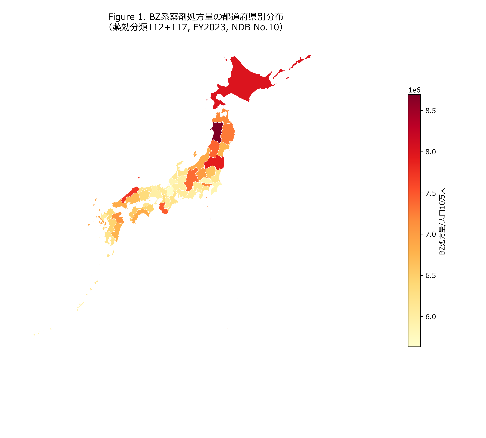
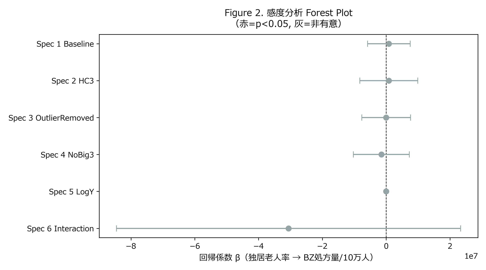
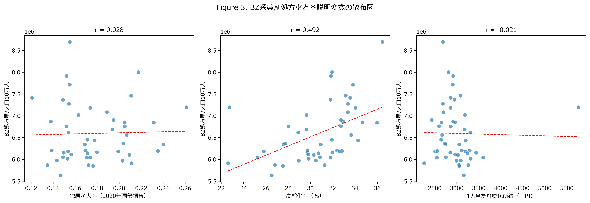
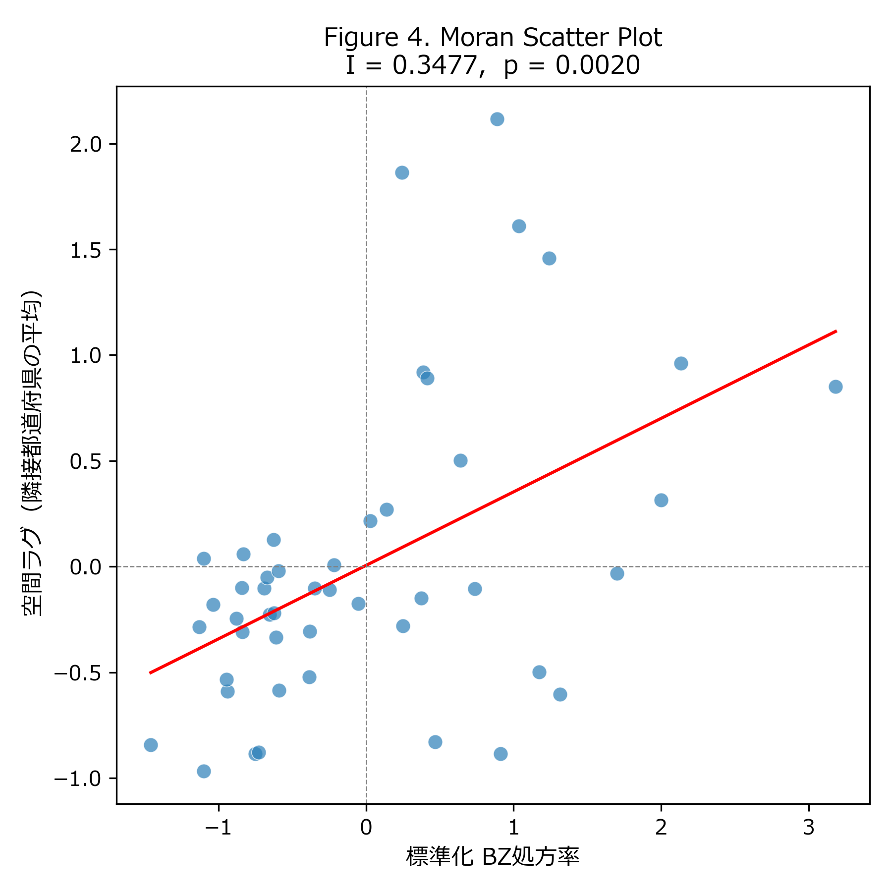
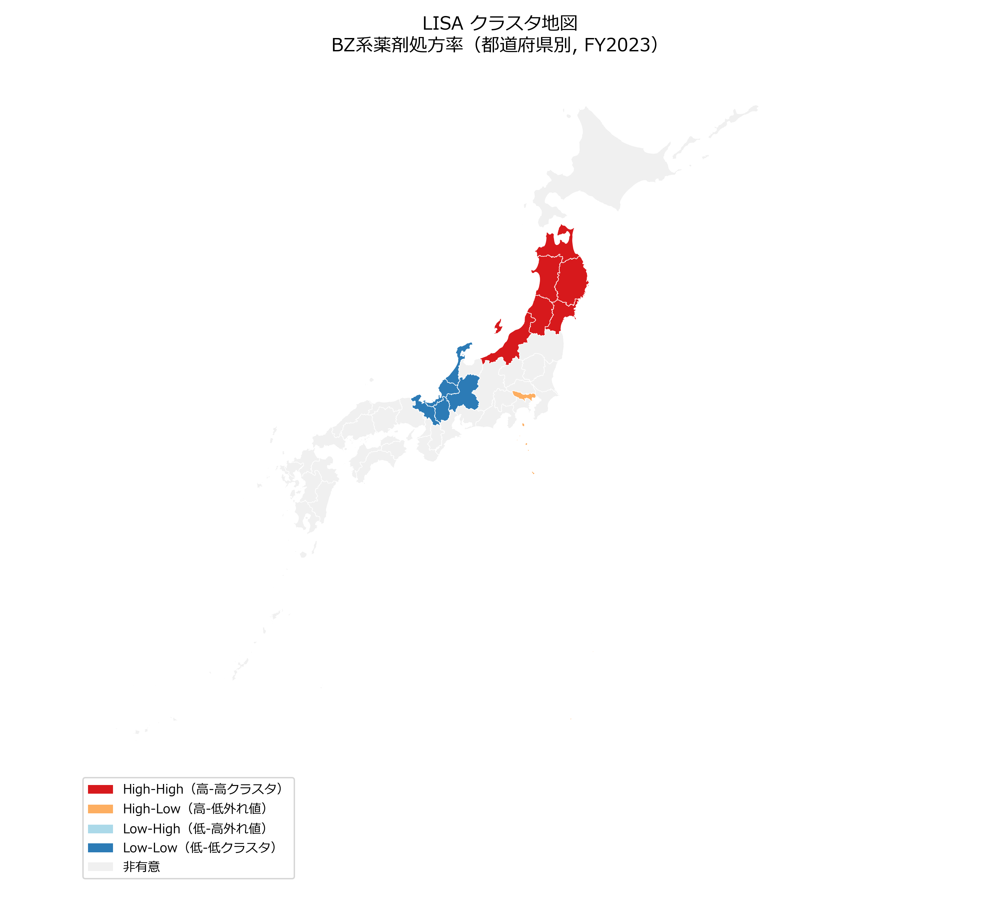

# Abstract

**Background:** Social isolation among older adults is an emerging public health concern in rapidly aging societies. Benzodiazepine (BZ) receptor agonists—including hypnotics and anxiolytics—are frequently prescribed for sleep disturbances and anxiety disorders, conditions closely linked to social isolation. However, the relationship between social isolation and BZ prescribing at the regional level in Japan remains unknown.

**Methods:** We conducted a cross-sectional ecological study using prefecture-level data (N = 47) from Japan. The primary exposure was the proportion of older adults (aged ≥65 years) living alone (solo elderly rate), derived from the 2020 National Census. The primary outcome was the volume of BZ drug prescriptions (drug effect classification codes 112 and 117) per 100,000 population, obtained from the 10th National Database (NDB) Open Data (FY2023). Secondary outcomes included home care patient volume and psychiatric specialty therapy patient volume. Ordinary least squares regression with heteroscedasticity-consistent (HC3) standard errors was used, with aging rate, population density, and per capita prefectural income as covariates. Sensitivity analyses were conducted across six model specifications. Spatial autocorrelation was assessed using Global Moran's I with Queen contiguity weights (999 permutations).

**Results:** Among 47 prefectures, the mean solo elderly rate was 0.177 (SD 0.031; range: 0.121–0.261), derived from the 2020 National Census small-area mesh data. The solo elderly rate was not significantly associated with BZ prescription volume in the primary HC3 analysis (β = 838,000 per 100,000, 95% CI −8.24 to 9.91 million, p = 0.856), and remained non-significant across all six sensitivity analyses (0/6 specifications). Aging rate was the only significant predictor (β = 151,480, p = 0.008), robust across all six specifications (6/6). BZ prescription rates demonstrated significant positive spatial autocorrelation (Global Moran's I = 0.348, p = 0.003), as did the solo elderly rate itself (Moran's I = 0.349, p = 0.001).

**Conclusions:** Prefecture-level older-adult living-alone rate was not independently associated with regional BZ prescribing disparities in Japan. The robust role of aging rate and the presence of spatial clustering suggest that demographic composition and supply-side factors—rather than social isolation—are primary determinants of regional BZ prescribing variation.

**Keywords:** social isolation; benzodiazepine; older adults; geographic disparities; ecological study; Japan

---

# Introduction

Japan has one of the world's most rapidly aging societies, with 29% of its population aged 65 years or older as of 2023 [@statistics_bureau_japan_2023]. A growing proportion of older adults live alone: the 2020 National Census reported that approximately 21% of individuals aged 65 and over resided in single-person households [@census_2020]. Social isolation—often operationalized as living alone—has been associated with adverse health outcomes including depression, sleep disturbance, anxiety, cognitive decline, and increased mortality [@holt_lunstad_2015; @cacioppo_2010].

Benzodiazepine (BZ) receptor agonists, encompassing both classic benzodiazepines and Z-drugs (non-benzodiazepine hypnotics), are widely prescribed for insomnia and anxiety disorders, conditions that are disproportionately prevalent among socially isolated older adults [@lader_2011; @inoue_2023; @noguchi_2021]. Long-term BZ use is associated with falls, hip fractures, cognitive impairment, and physical dependence, representing a significant public health burden in elderly populations [@cumming_1998; @zint_2010; @campbell_2011].

Japan's universal health insurance system in principle provides equitable access to medications regardless of socioeconomic status or geography. However, prior ecological research using NDB Open Data has demonstrated substantial prefectural variation in disease management rates and drug prescribing patterns—driven not only by patient-level factors but also by supply-side determinants such as physician density and regional prescribing cultures [@okui_2022; @okui_2023_multipsy; @poverty_tgi_citation_placeholder].

Whether the geographical distribution of BZ prescribing in Japan is associated with the degree of social isolation among older adults remains unexplored. Understanding this relationship has policy implications: if socially isolated regions exhibit higher BZ prescribing, community-based interventions targeting loneliness reduction could potentially serve as a lever to reduce inappropriate BZ use and its downstream harms.

The objective of this study was to examine whether the prefecture-level proportion of older adults living alone is associated with BZ prescribing volume, using data from the NDB Open Data linked with the 2020 National Census.

---

# Methods

## 1. Study Design and Setting

We conducted a cross-sectional ecological study at the prefecture level in Japan (N = 47 prefectures). Data were pooled from the 10th NDB Open Data (fiscal year 2023 receipts) and the 2020 National Census.

## 2. Exposure Variable

The primary exposure was the **solo elderly rate**, defined as the number of single-person general households with a householder aged 65 years or older divided by the total population aged 65 years or older, derived from the 2020 National Census (Statistics Bureau, Ministry of Internal Affairs and Communications).

## 3. Outcome Variables

**Primary outcome:** Total BZ drug prescription volume (drug effect classification codes 112 [hypnotics/sedatives] and 117 [neuropsychiatric agents]) per 100,000 population, obtained from the 10th NDB Open Data (FY2023), specifically from the outpatient (clinic-based and hospital-based) prescription records.

**Secondary outcomes:**
1. Home care patient volume (home medical care category) per 10,000 elderly population (aged ≥65 years), as a proxy for healthcare utilization among homebound elderly.
2. Psychiatric specialty therapy patient volume (psychiatric specialty therapy fee category) per 100,000 population, reflecting the regional burden of treated mental health conditions.

## 4. Covariates

The following prefecture-level covariates were included based on prior literature and theoretical considerations:

- **Aging rate:** Proportion of the population aged ≥65 years (2023 population estimate, Statistics Bureau).
- **Population density:** Persons per km² (2023 population estimate).
- **Per capita prefectural income:** Prefectural income per capita in thousands of yen (FY2021, Cabinet Office National Economic Accounts).

## 5. Statistical Analysis

Ordinary least squares (OLS) regression with heteroscedasticity-consistent (HC3) standard errors was used as the primary analytical approach to account for potential heteroscedasticity [@white_1980; @mackinnon_1985]. The main model was:

$$\text{BZ\_drug\_rate}_i = \beta_0 + \beta_1 \cdot \text{solo\_elderly\_rate}_i + \beta_2 \cdot \text{aging\_rate}_i + \beta_3 \cdot \text{pop\_density}_i + \beta_4 \cdot \text{income\_per\_capita}_i + \varepsilon_i$$

Variance inflation factors (VIF) were calculated to assess multicollinearity; VIF > 10 was considered indicative of problematic multicollinearity.

**Sensitivity analyses** were conducted across six model specifications to assess robustness:
1. Standard OLS without robust standard errors (Spec1)
2. HC3 robust standard errors (Spec2; primary analysis)
3. Exclusion of prefectures with BZ prescription rates beyond ±2 SD of the mean (Spec3)
4. Exclusion of the three largest metropolitan prefectures (Tokyo, Osaka, Aichi; Spec4)
5. Log-transformed outcome (Spec5)
6. Inclusion of a solo elderly rate × income interaction term (Spec6)

**Spatial autocorrelation** of the primary outcome and exposure variables was assessed using Global Moran's I statistic with Queen contiguity weights, row-standardized, and 999 permutations [@moran_1950; @anselin_1995]. Local Indicators of Spatial Association (LISA) were computed to identify spatial clusters [@anselin_1995]. For isolated island prefectures (Okinawa), K-nearest neighbour (K = 2) supplementation was applied.

All analyses were performed in Python 3.11 using statsmodels 0.14, libpysal 4.9, esda 2.5, and geopandas 0.14. A two-sided significance level of α = 0.05 was used throughout.

---

# Results

## 1. Descriptive Statistics

Across 47 prefectures, the mean solo elderly rate was 0.177 (SD 0.031; range 0.121-0.261). Descriptive statistics for key exposure, outcome, and covariate variables are summarized in Table 1.

## 2. Main Regression Results

In the primary HC3 model, solo elderly rate was not significantly associated with BZ prescription volume (beta = 838,000 per 100,000; 95% CI -8.24 to 9.91 million; p = 0.856). Aging rate was the only significant predictor (beta = 151,480; p = 0.008). Detailed regression coefficients are presented in Table 2.

## 3. Sensitivity Analyses

Across six prespecified sensitivity models, the solo elderly coefficient remained non-significant in all specifications (0/6), whereas aging rate remained significant in all specifications (6/6). Supplementary Table S1 summarizes coefficient stability across models.

## 4. Secondary Outcomes

For secondary outcomes (home care utilization and psychiatric specialty therapy volume), no consistent significant association with solo elderly rate was observed. Detailed results are provided in Table 3.

## 5. Spatial Autocorrelation

Global Moran's I indicated significant positive spatial autocorrelation for BZ prescription rate (I = 0.348, p = 0.003) and for solo elderly rate (I = 0.349, p = 0.001). These findings indicate spatial clustering beyond measured covariates.

# Discussion

## 1. Main Findings

In this prefecture-level ecological study examining whether the proportion of elderly persons living alone explains regional variation in BZ prescribing in Japan, we found no significant association between the solo elderly rate and BZ drug prescription volume. The solo elderly rate—derived from 2020 National Census small-area mesh data—was non-significant in all six sensitivity analyses (0/6 specifications), indicating that this null result is robust across different analytical choices. In contrast, aging rate was a consistent, significant predictor (β = 151,480 per one percentage-point increase, p = 0.008; 6/6 sensitivity specifications), with the overall model explaining 32.2% of prefectural variance in BZ prescriptions (R² = 0.322).

The null finding for the solo elderly rate aligns with results from a related study examining economic deprivation (welfare recipient rate) and antidiabetic drug prescribing in Japan [@poverty_tgi_citation_placeholder], which similarly found non-significant effects for its primary exposure. Together, these findings suggest that in Japan's universal health insurance system, access to prescription medications is relatively equalized across prefectures regardless of social or economic disadvantage at the population level [@okui_2022; @okuda_2023].

Despite the null finding for the primary hypothesis, BZ prescription rates exhibited significant positive spatial autocorrelation (Global Moran's I = 0.348, p = 0.003), as did the solo elderly rate itself (I = 0.349, p = 0.001) and home care utilization (I = 0.244, p = 0.011). This spatial clustering of BZ prescribing—unexplained by the measured covariates—is consistent with supply-side determinants such as regional prescribing culture, psychiatrist density, or guidelines adoption disparities that were not captured in this ecological analysis [@okui_2022; @okui_2023_multipsy; @hirano_2019; @okada_2022].

## 2. Comparison with Previous Studies

Prior research on determinants of BZ use in community-dwelling older adults has yielded findings that, in retrospect, align with our null result. A prospective Dutch cohort study found that living alone was independently associated with a *reduced* risk of new-onset chronic benzodiazepine use, whereas depression, chronic pain, and poor self-rated health were the primary positive predictors [@luijendijk_2008]. This counterintuitive finding suggests that household-level structural isolation—without concurrent loneliness or subjective psychological distress—does not straightforwardly elevate BZ consumption, even at the individual level. The absence of a prefecture-level association observed in the present study may therefore reflect a parallel phenomenon at the ecological scale: high rates of older adults living alone do not indicate equivalently high rates of the psychological symptoms (depression, anxiety, insomnia) that actually drive BZ prescribing, particularly if socially engaged community activities partially offset the adverse mental health consequences of living alone [@ejiri_2019; @kino_2023].

In Japan specifically, Okui and Park demonstrated substantial prefectural variation in hypnotic and anxiolytic prescribing (2015–2018) using nationwide claims data, identifying socioeconomic indicators, obesity prevalence, and psychiatric physician supply as key explanatory factors, with no analysis of social isolation [@okui_2022]. A subsequent ecological study at the secondary medical-area level confirmed that higher psychiatrist density was independently associated with multi-psychotropic polypharmacy, further implicating supply-side infrastructure as a dominant driver of regional prescribing heterogeneity [@okui_2023_multipsy]. Japan's BZ prescribing volume has historically ranked among the highest in OECD countries, and—despite incremental declines following polypharmacy reduction policies introduced in 2012 and 2018—absolute prescription volumes remain elevated [@okui_2021_trends; @okuda_2023; @hirano_2019; @takeshima_policy_2024]. Against this backdrop, the present study is the first to directly test whether the prefecture-level prevalence of elderly individuals living alone explains this sustained regional variation in BZ prescribing, and finds that it does not.

## 3. Strengths

This study has several strengths. First, robustness of the primary null association was systematically evaluated across six sensitivity specifications, and the solo elderly coefficient remained non-significant in all models. Second, integration of spatial statistics (Global Moran's I and LISA) enabled explicit evaluation of geographic clustering beyond conventional regression outputs. Third, consistency checks using secondary outcomes (home care and psychiatric specialty therapy volumes) provided additional context for interpreting whether the primary finding was outcome-specific or structurally similar across related healthcare indicators. Fourth, comparison with prior Japanese ecological studies helped situate the findings within broader evidence on regional prescribing variation under universal health coverage.

## 4. Limitations

Several limitations should be considered. First, this ecological design is inherently vulnerable to ecological fallacy; prefecture-level associations cannot be interpreted as individual-level effects, and socially isolated subgroups with higher prescribing risk may be obscured by aggregation [@inoue_2023; @oe_2023; @lunar_2025]. Second, there is temporal mismatch between exposure and outcome, because solo elderly rate was derived from the 2020 Census whereas BZ prescribing reflects FY2023 claims, potentially introducing measurement drift during a period of rapid demographic change. Third, NDB procedure counts represent cumulative encounters rather than unique individuals, which may inflate utilization-based indicators. Fourth, key supply-side variables (for example psychiatrist density, local deprescribing policy uptake, and prescribing culture) were not directly adjusted; the observed spatial clustering supports the likelihood of residual regional confounding [@okui_2023_multipsy; @nishimura_2024]. Fifth, this cross-sectional regional analysis cannot establish causality, and longitudinal individual-level designs are needed to test whether social isolation causally contributes to BZ prescribing patterns.

---

# Conclusions

In this prefecture-level ecological study using 2020 National Census small-area mesh data and NDB Open Data FY2023, the proportion of older adults living alone was not independently associated with regional BZ drug prescribing volume in Japan. Aging rate emerged as the dominant demographic predictor, with significant effects robust across all six analytical specifications (β = 151,480, p = 0.008, 6/6 specifications). The spatial clustering of BZ prescribing (Moran's I = 0.348, p = 0.003) was not explained by the solo elderly rate, pointing toward supply-side or regional cultural factors as primary drivers of geographic variation. These findings suggest that interventions targeting individual-level social isolation may not translate into measurable reductions in BZ prescribing at the population level; instead, efforts to address BZ overprescribing in older adults should focus on supply-side factors such as physician prescribing education, regional guideline implementation, and deprescribing initiatives [@nishimura_2024; @hirano_2019; @okada_2022]. Community-based social prescribing approaches may complement pharmacological deprescribing by reducing the psychological burden of isolation that underlies sleep and anxiety complaints [@ota_2025].

---

# Data availability

The NDB Open Data used in this study are publicly available from the Ministry of Health, Labour and Welfare of Japan (https://www.mhlw.go.jp/stf/seisakunitsuite/bunya/0000177182.html). National Census data were obtained from the e-Stat portal of the Statistics Bureau, Ministry of Internal Affairs and Communications (https://www.e-stat.go.jp/). Analytical scripts are available from the corresponding author upon reasonable request.

---

# Declaration of generative AI and AI-assisted technologies in the manuscript preparation process

During the preparation and writing of this work, the authors used an AI-assisted tool (Claude Code, Anthropic) to support analytical scripting and manuscript drafting. This tool was used only for text and code assistance; no generative AI or AI-assisted tools were used to create, alter, or otherwise process any figures, images, or artwork in this manuscript. The authors reviewed and edited all AI-assisted outputs and were responsible for the study design, choice of methods, interpretation of findings, conclusions, conflict-of-interest declaration, and final reference list. The authors take full responsibility for the integrity and accuracy of the final content. AI was not listed as an author.

---

# References

::: {#refs}
:::

---

# Tables and Figures

## Table 1. Descriptive statistics of prefecture-level variables (N = 47)

| Variable | Unit | N | Mean | SD | Min | Max |
| :--- | :--- | ---: | ---: | ---: | ---: | ---: |
| BZ prescription rate | per 100,000 population | 47 | 6,595,793.253 | 666,996.089 | 5,634,020.856 | 8,694,110.025 |
| Solo elderly rate | proportion | 47 | 0.177 | 0.031 | 0.121 | 0.261 |
| Aging rate | % | 47 | 30.743 | 3.103 | 22.609 | 36.445 |
| Population density | persons/km² | 47 | 657.001 | 1,223.134 | 62.627 | 6,402.644 |
| Per capita prefectural income | 1,000 JPY | 47 | 2,992.404 | 498.904 | 2,258.000 | 5,761.000 |
| Home care rate | per 10,000 elderly population | 47 | 2,667.638 | 590.906 | 1,551.118 | 4,856.298 |
| Psychiatric specialty therapy rate | per 100,000 population | 47 | 7,879.348 | 958.073 | 6,325.442 | 11,716.939 |

*Note.* `BZ prescription rate` is defined as dispensed outpatient prescription quantity (external + in-hospital outpatient dispensing) per 100,000 total population, not the number of unique patients. `Home care rate` is per 10,000 population aged ≥65 years, whereas `Psychiatric specialty therapy rate` is per 100,000 total population.

## Table 2. OLS regression results (HC3 robust SE): BZ prescription rate as outcome

| Variable | Beta (95% CI) | p value |
| :--- | :--- | ---: |
| Solo elderly rate | 838,423.49 (-8,235,377.18 to 9,912,224.17) | 0.856 |
| Aging rate | 151,479.95 (40,048.16 to 262,911.75) | 0.008 |
| Population density | 107.37 (-166.45 to 381.18) | 0.442 |
| Per capita prefectural income | 231.23 (-740.85 to 1,203.31) | 0.641 |

*Note.* Coefficients are unstandardized and interpreted per 1-unit increase in each predictor. For `solo_elderly_rate` (proportion scale, 0 to 1), a 1.00 increase corresponds to 100 percentage points; therefore, the coefficient per 0.01 increase (1 percentage point) is approximately beta/100.

## Table 3. OLS regression results for secondary outcomes (HC3 robust SE)

| Outcome | Solo elderly rate coefficient | p value |
| :--- | :--- | ---: |
| Home care rate | 4,104.09 (-24.07 to 8,232.24) | 0.051 |
| Psychiatric specialty therapy rate | 2,924.06 (-12,902.52 to 18,750.65) | 0.717 |

*Note.* The coefficient shown is the unstandardized beta for `solo_elderly_rate` per 1.00 increase (100 percentage points). Approximate effect per 0.01 increase (1 percentage point) can be obtained by dividing beta and its confidence limits by 100.

## Supplementary Table S1. Sensitivity analyses: solo elderly rate coefficient across six specifications

| Specification | Beta (95% CI) for solo elderly rate | p value | Significant (p < 0.05) |
| :--- | :--- | ---: | :---: |
| Spec1 (standard OLS) | 838,423.49 (-5,844,664.89 to 7,521,511.88) | 0.801 | No |
| Spec2 (HC3; primary) | 838,423.49 (-8,235,377.18 to 9,912,224.17) | 0.856 | No |
| Spec3 (excluding +/-2 SD outliers) | -9,040.07 (-7,651,233.68 to 7,633,153.54) | 0.998 | No |
| Spec4 (excluding Tokyo, Osaka, Aichi) | -1,509,008.31 (-10,272,481.77 to 7,254,465.15) | 0.736 | No |
| Spec5 (log-transformed outcome) | 0.170 (-1.131 to 1.471) | 0.798 | No |
| Spec6 (interaction model) | -30,599,554.25 (-84,555,947.04 to 23,356,838.53) | 0.266 | No |

*Note.* For Specs 1-4 and 6, coefficients are on the original `bz_drug_rate` scale (dispensed outpatient prescription quantity per 100,000 population). Spec 5 uses log-transformed outcome (`log_bz_drug_rate`), so coefficients represent changes on the log scale.

## Figure Legends

**Figure 1.** Prefectural distribution of BZ drug prescription rates (FY2023).

**Figure 2.** Forest plot of sensitivity analyses showing the association between solo elderly rate and BZ prescription rate across six model specifications (red indicates *p* < 0.05; grey indicates non-significant estimates).

**Figure 3.** Scatter plots of BZ prescription rate against solo elderly rate, aging rate, and per capita income.

**Figure 4.** Moran scatter plot for BZ prescription rate.

**Figure 5.** Local Indicators of Spatial Association (LISA) cluster map for BZ prescription rate.

## Figure 1

## Figure 2

## Figure 3

## Figure 4

## Figure 5

